# Linux Shell Scripting (Generating a Multiplication Table)
This project is about using bash script to generate a multiplication table from a user input.
# Flow chart and pseudo code development
- A flow chart on steps taken for the multiplication table generation was draw out.
- Pseudo code was used as a sketch for the main code
# Writing the code.
- Creating a .sh file using `vim` syntax
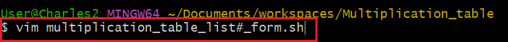
## Creating function to display the table.
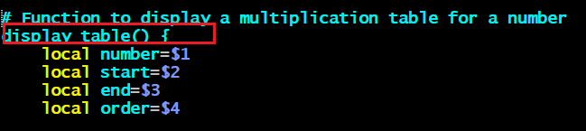
- Writing the for list loop for the ascending order using `for` and `seq` syntax

- Writing the for list loop for the descending order using `seq` syntax
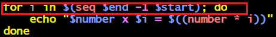
- Ending the function
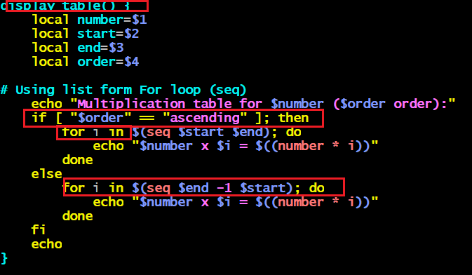

## Prompting User input.
- Asking user to provide number with `echo` syntax
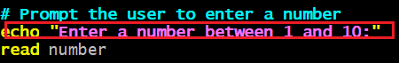
## Handling invalid number.
- Handling the invalid number from user `if` and `then` synatx, and by echoing, invalid number enter number 1 to 10.

## User input for table choice
This ask user either to display a full table or partial with a range.
- Echoing user inout with `echo` syntax.
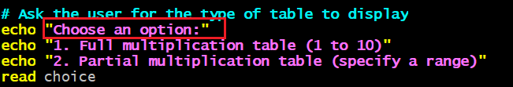
- Setting the condition for the table type choice usinf `case` syntax.
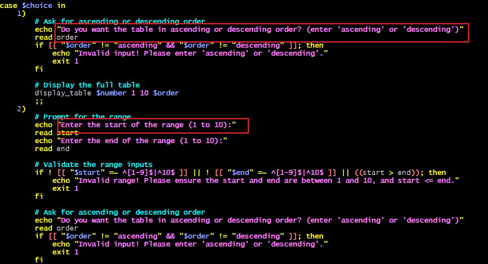
- Handling invalid table choice.
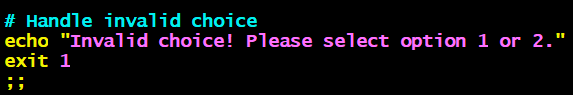
## Using c-style for loop
- creating a for loop using c-style and retaining other variable name.
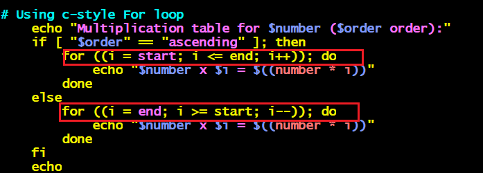
## Executing the multiplication table .sh file
- save the .sh file and chage the mode to executable mode using `:wq` and `chmod +x` syntax.
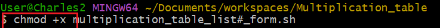
- Execute the .sh file with `./` syntax
- bash output with user input request
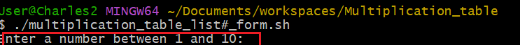
## Testing
- output with table choice request
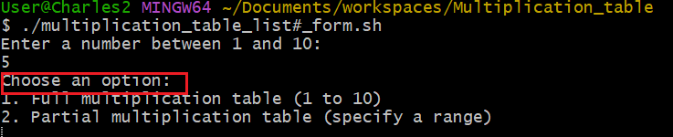
- output showing user choice for table ascending and descending
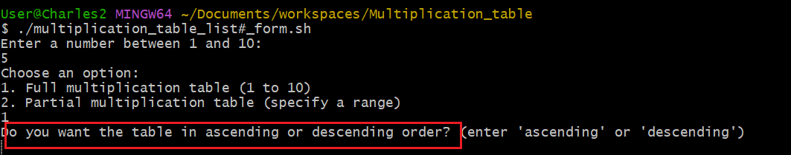
- output table in readable format
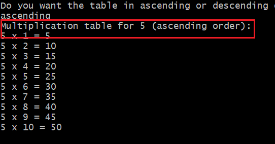
- Invalid output
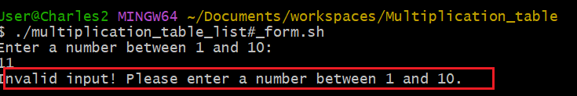
